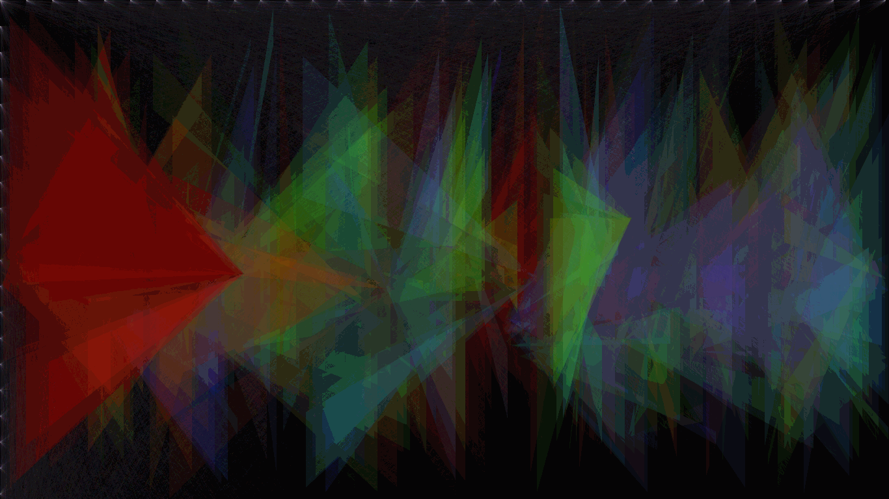

# DigitalImageProcessing---Spring2021"

The full question is attached in the relevant folder. 

## HW3
1. Smoothing, sharpening, 2d-convolution 
1. Spatial Filterning (linear and non-linear) 
1. Intensity transformations: for contrast manipulation or image thresholding & Power-Law (Gamma) Transformation
1. Bit plane slicing & Motion detector ✈

## HW5
1. Multiplicative and additive noise ❌➕
1. Morphological closing, opening, dilation, erosion with hand 😄!
1. Sinusoid Noise
1. Image enhancement with morphological operations 
1. Edge detection with morphological operations (+ hole filling)

## HW6
1. Automatic thresholding with k-means clustering 
1. Joint Histogram for two images each with 3 histogram bins (I1, I2, I3)
1. Hough Circle Transform ⭕
1. Feature-based registeration with GUI (OpenCV)

